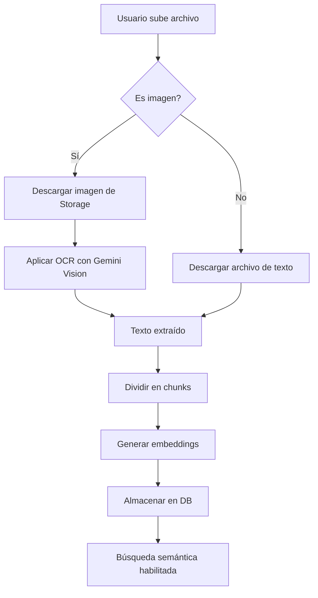

# 📸 Funcionalidad OCR para Documentos con Imágenes

## 🎯 Descripción

EstudIA ahora puede **extraer texto de imágenes** usando la tecnología de visión de Google Gemini. Esto permite que los estudiantes suban fotos de sus apuntes, pizarrones, libros o documentos escaneados, y el sistema los procesará automáticamente.

---

## ✨ Nuevas Herramientas

### 1. `extract_text_from_image`

Extrae texto de una imagen usando OCR (Reconocimiento Óptico de Caracteres).

**Parámetros:**
```python
extract_text_from_image(
    storage_path: str,        # Ruta del archivo en Supabase Storage
    bucket_name: str = "uploads"  # Nombre del bucket (default: "uploads")
)
```

**Retorna:**
```python
{
    "success": True,
    "extracted_text": "Texto completo extraído de la imagen...",
    "text_length": 1250,
    "storage_path": "documents/image.jpg",
    "bucket": "uploads",
    "mime_type": "image/jpeg",
    "preview": "Primeros 200 caracteres..."
}
```

**Ejemplo de uso:**
```python
result = await extract_text_from_image(
    storage_path="classroom/apuntes_matematicas.jpg",
    bucket_name="uploads"
)

if result["success"]:
    texto = result["extracted_text"]
    print(f"Texto extraído: {texto}")
```

---

### 2. `process_and_store_document` 🚀

**¡La función más poderosa!** Procesa cualquier documento (texto o imagen) automáticamente.

**Características:**
- ✅ **Detección automática**: Identifica si es imagen o texto
- ✅ **OCR inteligente**: Si es imagen, extrae el texto automáticamente
- ✅ **Chunking automático**: Divide el contenido en fragmentos óptimos
- ✅ **Embeddings**: Genera vectores semánticos para cada chunk
- ✅ **Almacenamiento**: Guarda todo en la base de datos

**Parámetros:**
```python
process_and_store_document(
    classroom_document_id: str,   # ID del documento en classroom_documents
    auto_chunk: bool = True,      # Dividir automáticamente en chunks
    chunk_size: int = 1000        # Tamaño de cada chunk (caracteres)
)
```

**Retorna:**
```python
{
    "success": True,
    "document_id": "uuid-del-documento",
    "is_image": True,              # Indica si era una imagen
    "ocr_applied": True,           # Indica si se aplicó OCR
    "total_chunks": 5,             # Número de chunks creados
    "total_characters": 4850,      # Total de caracteres procesados
    "chunk_size_used": 1000,
    "chunks": [                    # Lista de chunks almacenados
        {
            "chunk_id": "uuid-chunk-1",
            "chunk_index": 0,
            "content_length": 1000
        },
        // ... más chunks
    ],
    "content_preview": "Primeros 300 caracteres del contenido..."
}
```

**Ejemplo de uso:**
```python
# Procesar automáticamente una imagen o texto
result = await process_and_store_document(
    classroom_document_id="550e8400-e29b-41d4-a716-446655440000",
    auto_chunk=True,
    chunk_size=800
)

if result["success"]:
    print(f"✅ Documento procesado")
    print(f"   - OCR aplicado: {result['ocr_applied']}")
    print(f"   - Chunks creados: {result['total_chunks']}")
    print(f"   - Caracteres: {result['total_characters']}")
```

---

## 🖼️ Formatos de Imagen Soportados

- **JPEG/JPG** (.jpg, .jpeg)
- **PNG** (.png)
- **GIF** (.gif)
- **WebP** (.webp)
- **BMP** (.bmp)
- **HEIC/HEIF** (.heic, .heif) - Formato de iPhone

---

## 📋 Casos de Uso

### 1. **Estudiante sube foto de apuntes de clase**

```python
# El estudiante sube una foto desde su móvil
# Flujo completo:

# 1. Frontend sube la imagen a Supabase Storage
file_path = "classroom-123/apuntes-fisica-2024.jpg"

# 2. Backend crea el registro en classroom_documents
doc = await supabase_client.client.table("classroom_documents").insert({
    "classroom_id": classroom_id,
    "title": "Apuntes de Física - Cinemática",
    "file_path": file_path,
    "file_type": "image/jpeg",
    "bucket": "uploads"
}).execute()

# 3. Procesar automáticamente con OCR
result = await process_and_store_document(
    classroom_document_id=doc.data[0]["id"]
)

# ✅ Listo! El texto está extraído, dividido en chunks y listo para búsqueda
```

### 2. **Profesor sube documento escaneado**

```python
# Documento PDF escaneado (que es básicamente una imagen)
result = await process_and_store_document(
    classroom_document_id=document_id,
    chunk_size=1500  # Chunks más grandes para documentos largos
)
```

### 3. **Estudiante hace captura de pantalla de presentación**

```python
# Captura de una diapositiva de PowerPoint
result = await extract_text_from_image(
    storage_path="screenshots/clase-biologia-slide5.png"
)

# Usar el texto extraído para generar resumen con IA
if result["success"]:
    texto = result["extracted_text"]
    resumen = await generar_resumen(texto)
```

---

## 🔧 Instalación de Dependencias

Para que la funcionalidad OCR funcione, necesitas instalar Pillow:

```bash
pip install Pillow>=10.0.0
```

O simplemente:

```bash
pip install -r requirements.txt
```

---

## ⚡ API Gratuita de Gemini

**¡Sí! Todo esto funciona con la API gratuita de Google Gemini.**

### Límites del Tier Gratuito:
- ✅ **15 requests por minuto**
- ✅ **1 millón de tokens por minuto**
- ✅ **1,500 requests por día**
- ✅ **Entrada multimodal** (texto + imágenes)
- ✅ **Tamaño de imagen**: Hasta 4MB
- ✅ **OCR incluido** sin costo adicional

### Modelos que soportan imágenes:
- `gemini-2.0-flash-exp` ✅ (el que usas por default)
- `gemini-1.5-flash` ✅
- `gemini-1.5-pro` ✅

---

## 📊 Flujo Completo del Sistema



---

## 🧪 Pruebas

Ejecuta el test de OCR:

```bash
python test_ocr_functionality.py
```

Este test:
1. ✅ Crea una imagen de prueba con texto educativo
2. ✅ La sube a Supabase Storage
3. ✅ Extrae el texto con OCR
4. ✅ Procesa el documento automáticamente
5. ✅ Crea chunks y embeddings
6. ✅ Verifica que todo funcione correctamente

---

## ⚠️ Mejores Prácticas

### Para mejores resultados con OCR:

1. **Calidad de imagen:**
   - 📸 Fotos bien iluminadas
   - 🔍 Texto legible y enfocado
   - 📐 Imágenes con resolución adecuada (min. 800x600)

2. **Tipos de contenido:**
   - ✅ Texto impreso (mejor reconocimiento)
   - ✅ Escritura a mano clara
   - ⚠️ Escritura a mano difusa (puede tener errores)

3. **Idiomas:**
   - ✅ Español (excelente)
   - ✅ Inglés (excelente)
   - ✅ Otros idiomas latinos (muy bueno)

4. **Tamaño de chunks:**
   - 📄 Documentos cortos: 500-800 caracteres
   - 📚 Documentos largos: 1000-1500 caracteres
   - 📖 Libros/Manuales: 1500-2000 caracteres

---

## 🚀 Próximas Mejoras

Potenciales mejoras futuras:

- [ ] Procesar múltiples imágenes en batch
- [ ] Detectar y extraer fórmulas matemáticas
- [ ] Reconocer diagramas y convertirlos a descripción
- [ ] Soporte para PDFs con múltiples páginas
- [ ] Detección automática de tablas y estructuras
- [ ] Mejorar precisión con pre-procesamiento de imagen

---

## 📚 Recursos

- [Google Gemini Vision API](https://ai.google.dev/gemini-api/docs/vision)
- [Pillow Documentation](https://pillow.readthedocs.io/)
- [Supabase Storage](https://supabase.com/docs/guides/storage)

---

## 💡 Ejemplo Completo de Integración

```python
import asyncio
from src.main import process_and_store_document
from src.supabase_client import supabase_client

async def procesar_documento_estudiante(
    classroom_id: str,
    file_path: str,
    file_type: str,
    title: str
):
    """
    Función helper para procesar cualquier documento
    (texto o imagen) subido por un estudiante
    """
    
    # 1. Crear registro del documento
    doc = await asyncio.to_thread(
        lambda: supabase_client.client.table("classroom_documents").insert({
            "classroom_id": classroom_id,
            "title": title,
            "file_path": file_path,
            "file_type": file_type,
            "bucket": "uploads"
        }).execute()
    )
    
    document_id = doc.data[0]["id"]
    
    # 2. Procesar automáticamente (detecta si es imagen y aplica OCR)
    result = await process_and_store_document(
        classroom_document_id=document_id,
        auto_chunk=True,
        chunk_size=1000
    )
    
    # 3. Retornar resultado
    return {
        "document_id": document_id,
        "processed": result["success"],
        "ocr_applied": result.get("ocr_applied", False),
        "chunks_created": result.get("total_chunks", 0)
    }

# Uso:
resultado = await procesar_documento_estudiante(
    classroom_id="abc-123",
    file_path="fotos/apuntes.jpg",
    file_type="image/jpeg",
    title="Apuntes de Química"
)

print(f"✅ Documento procesado con OCR: {resultado['ocr_applied']}")
```

---

## 🎉 ¡Listo para usar!

Ahora EstudIA puede procesar **cualquier tipo de documento**, ya sea texto o imagen. Los estudiantes pueden:

- 📸 Tomar fotos de apuntes en clase
- 📱 Subir capturas de pantalla
- 📄 Escanear documentos
- 📚 Compartir páginas de libros
- 🎓 Procesar material educativo en cualquier formato

**Todo se procesa automáticamente y queda disponible para búsqueda semántica. ¡Sin esfuerzo adicional!** 🚀
